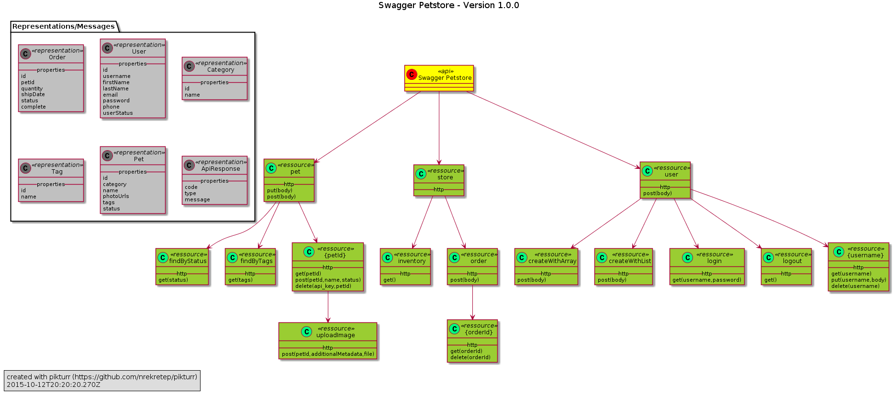

pikturr
=======

# Why? #

[swagger](http://swagger.io) is great tool to describe your restful api in a clear and structured way.
But as the spec gets longer and longer it could be sometimes useful to zoom out and look at your api from 10,000 feet.

__pikturr__ is a very simple tool to transform your swagger api spec into a simple uml class diagram.

# What? #

I'm new to the javascript and node party.
So please be patient and do not expect the ultra efficient javascript ninja code.
I find a visual representation of an api spec useful and I want to learn js and node...so I wrote this tool.
It's as simple as that.

# How? #

Because pikturr makes use of node-plantuml, which in turn makes use of...ehhh...[plantuml](http://plantuml.com/),
you have to fulfill some preconditions:
* you need to have the [java](https://www.java.com) executable in your path
* you must have [graphviz](http://www.graphviz.org/) installed
* the GRAPHVIZ_DOT environment variable must point the dot executable of graphviz

That's it for now.

Just get the code, look inside and you'll find out.

From the command line:

```
cd pikturr
npm install
// supply the url of the swagger as an argument
node index.js 'http://petstore.swagger.io/v2/swagger.yaml'
```

Pikturr supports a few command line arguments:  
`node index.js [-o|--output outputFilePath] [-u|--uml] url-or-filePath`

E.g.  
* `node index.js -o someDir/petstore-swagger.plantuml --uml http://petstore.swagger.io/v2/swagger.json`  
  Download the spec at: `http://petstore.swagger.io/v2/swagger.json`  
  and output uml script in a file named: `someDir/petstore-swagger.plantuml`

* `node index.js test/my-app-swagger.yaml`  
  Read spec from local file at: `test/my-app-swagger.yaml`  
  and output png diagram in a file named: `swagger.png`
  
If the `-o` or `--output` flag is not passed, the output file will be created in the working directory,
and will be named from the last token in the input reference.
   
If the `-u` or `--uml` flag is passed a plantuml script will be generated,  
else a png diagram will be generated.

As a module:

```
const pikturr = require(pikturr)
pikturr.generate('http://petstore.swagger.io/v2/swagger.yaml')
```



# Running Unit Tests
To run the test suite issue the following command:  
`npm test`

Feel free to extend the tests suite.

# What next? #

* re-structure code to meet nodejs project structure standards
* add some tests
* provide a rest api
* provide a simple web frontend
* provide some configurable options
